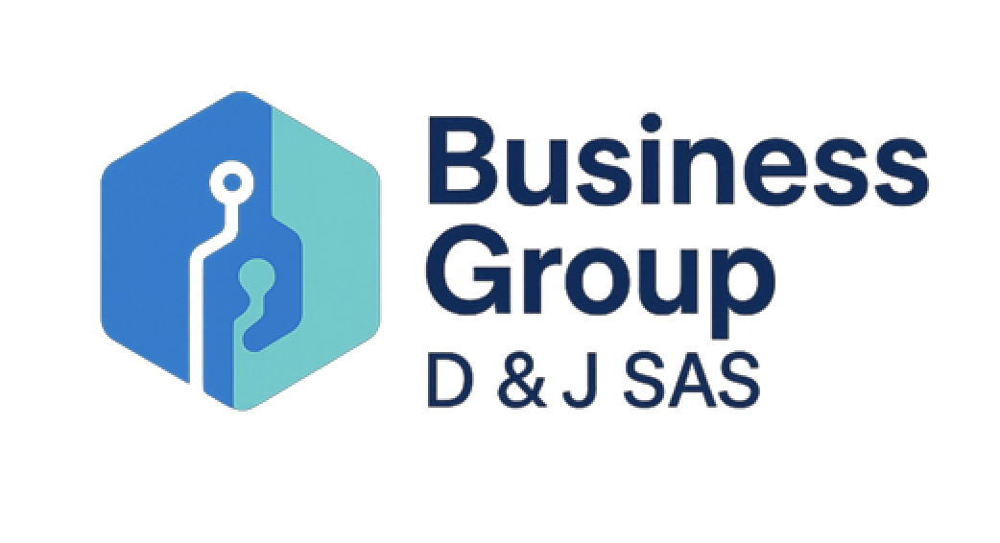

  

# Business Group D & J SAS

🚀 Empresa de desarrollo de software especializada en soluciones SaaS para droguerías y negocios del sector salud.

Contamos con más de 10 años de experiencia creando tecnología enfocada en optimizar procesos, mejorar el control del negocio y facilitar la operación diaria.

---

## 🏥 Nuestro Producto Principal

### LystoApp

**LystoApp** es un sistema POS en la nube diseñado especialmente para droguerías.

Permite administrar de forma sencilla y eficiente todos los procesos del negocio desde cualquier lugar.

---

## 💡 ¿Qué puedes hacer con LystoApp?

- 📦 Control completo de inventario
- 💰 Registro de ventas ágil y seguro
- 🧾 Facturación electrónica (DIAN)
- 📊 Reportes inteligentes para la toma de decisiones
- 🏪 Gestión de múltiples puntos de venta
- 👥 Control de usuarios y permisos
- 🔄 Integración con proveedores
- 📈 Seguimiento de productos y movimientos

---

## 🎯 ¿A quién está dirigido?

- Droguerías independientes
- Cadenas de farmacias
- Negocios del sector salud
- Emprendedores que quieren organizar su negocio

---

## ⚡ Beneficios

- Sistema en la nube (acceso desde cualquier lugar)
- Información centralizada y segura
- Ahorro de tiempo en procesos operativos
- Mayor control sobre el negocio
- Escalabilidad para crecimiento

---

## 🌐 Más información

👉 https://lystoapp.com/

---

## 📍 Ubicación

Cali, Colombia 🇨🇴

---

## 📫 Contacto

Si deseas implementar LystoApp en tu negocio:

🌐 https://lystoapp.com/

---

  Desarrollado por Business Group D & J SAS 💙

